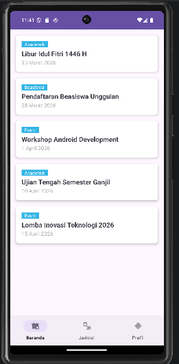
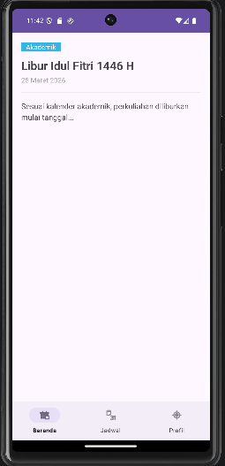
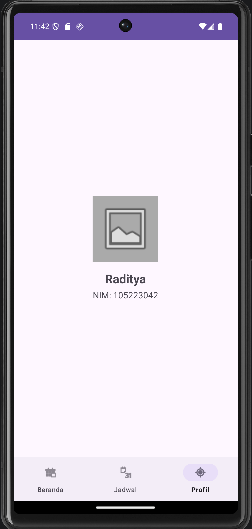
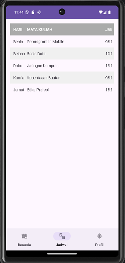

# CampusInfo App - Tugas THR PPB

Aplikasi ini dibuat untuk memenuhi tugas Mini Project mata kuliah Pemrograman Perangkat Bergerak (52310) Universitas Pertamina.

### Identitas Mahasiswa
- **Nama:** Raditya Rahmanda Putra
- **NIM:** 105223042
- **Kelas:** Pemrograman Perangkat Bergerak-CS6-2025

### Deskripsi Singkat
CampusInfo adalah aplikasi Android sederhana untuk melihat informasi kampus. Aplikasi ini menggunakan Kotlin dan beberapa fitur seperti Navigation Component, View Binding, dan ViewModel.

### Fitur Aplikasi
1. **Beranda:** Menampilkan daftar pengumuman (RecyclerView).
2. **Detail:** Melihat isi lengkap pengumuman (Safe Args).
3. **Jadwal:** Menampilkan tabel jadwal kuliah mingguan.
4. **Profil:** Menampilkan data diri mahasiswa (Shared ViewModel).

### Screenshot Aplikasi
Berikut adalah tampilan aplikasi CampusInfo:

1. **Halaman Home**
   
2. **Halaman Detail**
   
3. **Halaman Profil**
   
3. **Halaman Jadwal**
   

---
*Selamat Hari Raya Idul Fitri 1446 H - Mohon Maaf Lahir dan Batin.*
